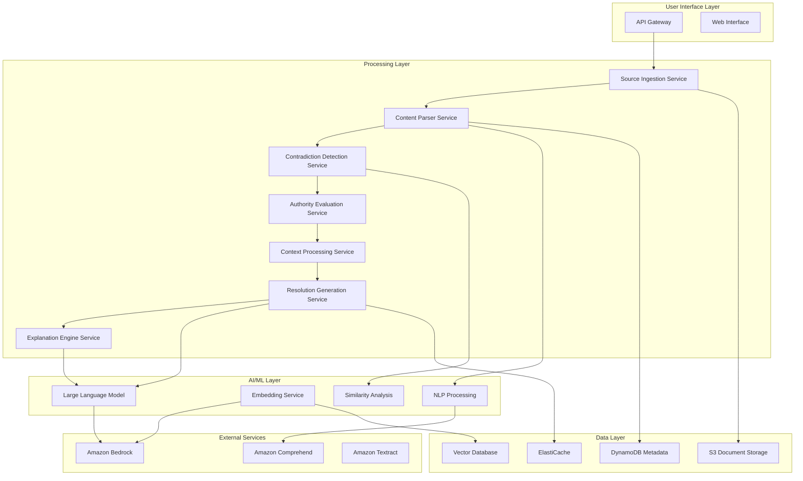

# Design Document: AI Truth Resolution Engine

## Overview

The AI Truth Resolution Engine is a serverless system built on AWS that ingests multiple information sources, detects contradictions, evaluates source authority, and produces explainable, confidence-ranked resolved answers. The system uses a microservices architecture with AI/ML components for natural language processing, contradiction detection, and resolution generation.

The design emphasizes explainability, responsible AI practices, and scalability while maintaining cost-effectiveness for a hackathon prototype that can evolve into a production system.

## Architecture

### High-Level System Architecture



### Component Architecture

The system follows a serverless-first approach using AWS Lambda functions orchestrated by AWS Step Functions, with each major component implemented as independent microservices.

## Components and Interfaces

### 1. Source Ingestion Service

**Responsibility**: Fetch and validate information sources from various endpoints.

**Implementation**: 
- AWS Lambda function triggered by API Gateway
- Supports HTTP/HTTPS URLs, S3 objects, and direct text input
- Uses Amazon Textract for PDF processing
- Implements retry logic and error handling

**Interface**:
```typescript
interface SourceIngestionRequest {
  sources: SourceInput[];
  requestId: string;
  userContext?: UserContext;
}

interface SourceInput {
  url?: string;
  content?: string;
  type: 'url' | 'text' | 's3';
  metadata?: SourceMetadata;
}

interface SourceIngestionResponse {
  requestId: string;
  ingestedSources: IngestedSource[];
  errors: IngestionError[];
}
```

### 2. Content Parser Service

**Responsibility**: Extract structured claims and metadata from ingested sources.

**Implementation**:
- AWS Lambda function using Amazon Comprehend for entity extraction
- Custom NLP pipeline for claim identification
- Structured data extraction with confidence scores

**Interface**:
```typescript
interface ContentParsingRequest {
  sources: IngestedSource[];
  requestId: string;
}

interface ParsedContent {
  sourceId: string;
  claims: ExtractedClaim[];
  metadata: ContentMetadata;
  confidence: number;
}

interface ExtractedClaim {
  text: string;
  entities: Entity[];
  topic: string;
  confidence: number;
  position: TextPosition;
}
```

### 3. Contradiction Detection Service

**Responsibility**: Identify conflicting claims across multiple sources using semantic similarity and logical analysis.

**Implementation**:
- AWS Lambda function with Amazon Bedrock embeddings
- Vector similarity search using Amazon OpenSearch Serverless
- Rule-based contradiction detection for structured data
- Machine learning model for semantic contradiction detection

**Interface**:
```typescript
interface ContradictionDetectionRequest {
  parsedContent: ParsedContent[];
  requestId: string;
}

interface ContradictionGroup {
  topic: string;
  contradictoryClaims: ClaimConflict[];
  conflictType: 'direct' | 'temporal' | 'quantitative' | 'semantic';
  confidence: number;
}

interface ClaimConflict {
  claim1: ExtractedClaim;
  claim2: ExtractedClaim;
  conflictReason: string;
  severity: 'high' | 'medium' | 'low';
}
```

### 4. Authority Evaluation Service

**Responsibility**: Assess source credibility and authority levels using configurable hierarchies and indicators.

**Implementation**:
- AWS Lambda function with DynamoDB authority database
- Configurable authority scoring rules
- Domain reputation analysis
- Temporal relevance scoring

**Interface**:
```typescript
interface AuthorityEvaluationRequest {
  sources: IngestedSource[];
  requestId: string;
}

interface AuthorityScore {
  sourceId: string;
  authorityLevel: number; // 0-1 scale
  factors: AuthorityFactor[];
  confidence: number;
  reasoning: string;
}

interface AuthorityFactor {
  type: 'official' | 'domain' | 'recency' | 'citations';
  score: number;
  weight: number;
}
```

### 5. Context Processing Service

**Responsibility**: Apply user-specific context to filter and prioritize information relevance.

**Implementation**:
- AWS Lambda function with context matching algorithms
- Geographic and demographic filtering
- Temporal context application
- Eligibility criteria matching

**Interface**:
```typescript
interface ContextProcessingRequest {
  parsedContent: ParsedContent[];
  userContext: UserContext;
  requestId: string;
}

interface UserContext {
  location?: GeographicContext;
  role?: UserRole;
  timeContext?: TemporalContext;
  eligibilityCriteria?: string[];
}

interface ContextualizedContent {
  content: ParsedContent;
  relevanceScore: number;
  applicabilityReasons: string[];
}
```

### 6. Resolution Generation Service

**Responsibility**: Produce final resolved answers with confidence scores using authority evaluation and context.

**Implementation**:
- AWS Lambda function with Amazon Bedrock Claude/GPT models
- Multi-step reasoning pipeline
- Confidence calculation algorithms
- Fallback resolution strategies

**Interface**:
```typescript
interface ResolutionRequest {
  contradictions: ContradictionGroup[];
  authorityScores: AuthorityScore[];
  contextualizedContent: ContextualizedContent[];
  requestId: string;
}

interface Resolution {
  resolvedAnswer: string;
  confidence: number;
  supportingSources: SourceReference[];
  alternativePerspectives?: AlternativePerspective[];
  limitations: string[];
  metadata: ResolutionMetadata;
}
```

### 7. Explanation Engine Service

**Responsibility**: Generate human-readable explanations for resolution decisions and reasoning.

**Implementation**:
- AWS Lambda function with Amazon Bedrock for natural language generation
- Template-based explanation generation
- Multi-level explanation detail (summary, detailed, technical)
- Source citation and verification links

**Interface**:
```typescript
interface ExplanationRequest {
  resolution: Resolution;
  processingSteps: ProcessingStep[];
  requestId: string;
  detailLevel: 'summary' | 'detailed' | 'technical';
}

interface Explanation {
  summary: string;
  reasoning: ReasoningStep[];
  sourcesConsidered: SourceSummary[];
  decisionFactors: DecisionFactor[];
  assumptions: string[];
  verificationLinks: VerificationLink[];
}
```

## Data Models

### Core Data Structures

```typescript
interface IngestedSource {
  id: string;
  url?: string;
  content: string;
  contentType: string;
  metadata: SourceMetadata;
  ingestionTimestamp: Date;
  hash: string;
}

interface SourceMetadata {
  title?: string;
  author?: string;
  publishDate?: Date;
  lastModified?: Date;
  domain: string;
  sourceType: 'government' | 'educational' | 'news' | 'official' | 'other';
  language: string;
}

interface ProcessingStep {
  service: string;
  timestamp: Date;
  input: any;
  output: any;
  processingTime: number;
  confidence?: number;
  errors?: string[];
}
```

### Storage Schema

**DynamoDB Tables**:
- `TruthResolution-Requests`: Request tracking and metadata
- `TruthResolution-Sources`: Source metadata and authority scores
- `TruthResolution-Cache`: Cached resolutions and intermediate results
- `TruthResolution-Authority`: Authority scoring rules and configurations

**S3 Buckets**:
- `truth-resolution-sources`: Raw source content storage
- `truth-resolution-processed`: Processed content and embeddings
- `truth-resolution-logs`: Audit logs and processing traces

## AI/ML Components

### Natural Language Processing Pipeline

**Amazon Comprehend Integration**:
- Entity extraction for people, organizations, locations, dates
- Sentiment analysis for bias detection
- Key phrase extraction for topic identification
- Language detection and confidence scoring

**Custom NLP Components**:
- Claim extraction using fine-tuned transformer models
- Topic classification for Indian government and educational domains
- Named entity recognition for Indian-specific entities

### Embedding and Similarity Analysis

**Amazon Bedrock Embeddings**:
- Text embedding generation using Titan Embeddings
- Semantic similarity calculation for contradiction detection
- Vector storage in Amazon OpenSearch Serverless
- Efficient similarity search with approximate nearest neighbor

### Large Language Model Integration

**Amazon Bedrock Claude Integration**:
- Resolution generation with structured prompting
- Explanation generation with citation requirements
- Confidence assessment through chain-of-thought reasoning
- Multi-shot prompting for consistent output format

**Prompt Engineering Strategy**:
- System prompts emphasizing accuracy and explainability
- Few-shot examples for Indian government context
- Chain-of-thought prompting for complex reasoning
- Output format constraints for structured responses

### Contradiction Detection Algorithm

**Multi-layered Approach**:
1. **Lexical Analysis**: Direct text contradiction detection
2. **Semantic Analysis**: Embedding-based similarity with contradiction thresholds
3. **Temporal Analysis**: Date and time conflict detection
4. **Quantitative Analysis**: Numerical value contradiction detection
5. **Logical Analysis**: Rule-based logical contradiction detection

## Error Handling

### Failure Modes and Mitigation

**Source Ingestion Failures**:
- Network timeouts: Retry with exponential backoff
- Invalid content: Skip source with error logging
- Rate limiting: Queue requests with delay
- Authentication failures: Log and notify administrators

**Processing Failures**:
- NLP service errors: Fallback to simpler processing
- Memory/timeout issues: Process in smaller chunks
- Model inference failures: Use cached results or simpler models
- Data corruption: Validate inputs and outputs at each step

**Resolution Generation Failures**:
- Low confidence scenarios: Present multiple perspectives
- Contradictory high-authority sources: Acknowledge uncertainty
- Insufficient information: Request additional sources
- Context mismatch: Provide general guidance with caveats

### Graceful Degradation Strategy

1. **Full Functionality**: All services operational
2. **Reduced AI**: Basic NLP without advanced reasoning
3. **Simple Aggregation**: Source listing without contradiction resolution
4. **Fallback Mode**: Error message with manual verification suggestions

## Testing Strategy

*A property is a characteristic or behavior that should hold true across all valid executions of a system—essentially, a formal statement about what the system should do. Properties serve as the bridge between human-readable specifications and machine-verifiable correctness guarantees.*

Now I need to analyze the acceptance criteria to determine which ones can be tested as properties before writing the Correctness Properties section.

### Correctness Properties

Based on the prework analysis and property reflection, the following properties ensure system correctness:

**Property 1: Source Processing Completeness**
*For any* set of valid information sources, the system should successfully ingest and extract structured claims with metadata from each accessible source, while gracefully handling inaccessible sources and preserving source attribution for all extracted claims.
**Validates: Requirements 1.1, 1.2, 1.3, 1.4, 1.5**

**Property 2: Contradiction Detection Accuracy**
*For any* set of sources containing contradictory claims on the same topic, the contradiction detector should identify and group the contradictions, distinguish between direct contradictions and nuanced differences, and properly flag temporal or quantitative conflicts.
**Validates: Requirements 2.1, 2.2, 2.3, 2.5**

**Property 3: Consensus Recognition**
*For any* set of sources that agree on a topic, the contradiction detector should confirm consensus across sources rather than falsely identifying contradictions.
**Validates: Requirements 2.4**

**Property 4: Authority Scoring Consistency**
*For any* pair of information sources, the authority evaluator should assign higher scores to sources with greater authority indicators, with government sources scoring higher than unofficial sources, and recency serving as a tiebreaker for equal authority sources.
**Validates: Requirements 3.1, 3.2, 3.3**

**Property 5: Authority Hierarchy Maintenance**
*For any* source evaluation, the system should apply the configured authority hierarchy consistently and assign neutral scores with uncertainty flags when authority cannot be determined.
**Validates: Requirements 3.4, 3.5**

**Property 6: Context-Based Filtering**
*For any* user context and set of information sources, the context processor should filter and prioritize information relevant to the user's geographical location, role, and temporal context, while preserving general information.
**Validates: Requirements 4.1, 4.2, 4.4**

**Property 7: Eligibility Criteria Highlighting**
*For any* user context with specific eligibility criteria, the system should highlight relevant conditions and requirements that match the user's situation.
**Validates: Requirements 4.3**

**Property 8: Context Completeness Handling**
*For any* incomplete user context, the system should request additional clarification or provide general guidance rather than making incorrect assumptions.
**Validates: Requirements 4.5**

**Property 9: Resolution Generation Consistency**
*For any* set of contradictory sources, the resolution generator should produce a single resolved answer based on authority and recency, assign appropriate confidence scores, and include complete metadata about the resolution process.
**Validates: Requirements 5.1, 5.2, 5.5**

**Property 10: Confidence-Based Presentation**
*For any* resolution with high confidence, the system should present it as the primary result, while low confidence resolutions should present multiple perspectives with appropriate caveats.
**Validates: Requirements 5.3, 5.4**

**Property 11: Explanation Completeness**
*For any* resolved answer, the explanation engine should generate human-readable explanations that identify authoritative sources, explain resolution reasoning for contradictions, highlight assumptions, and provide source citations.
**Validates: Requirements 6.1, 6.2, 6.3, 6.4, 6.5**

**Property 12: Data Protection and Compliance**
*For any* processed information, the system should comply with data privacy and security requirements, apply appropriate protection measures for sensitive information, and maintain proper audit logs.
**Validates: Requirements 7.2, 7.4, 7.5**

**Property 13: Caching Behavior**
*For any* frequently accessed information, the system should cache it appropriately to improve response times while maintaining data freshness.
**Validates: Requirements 7.3**

**Property 14: Graceful Error Handling**
*For any* error condition, the system should provide user-friendly error messages, continue operating with partial functionality when possible, flag data quality issues, and provide fallback responses when primary methods fail.
**Validates: Requirements 8.1, 8.2, 8.3, 8.4, 8.5**

**Property 15: English Language Processing**
*For any* English content in Indian context, the system should process it with high accuracy, handle mixed-language content appropriately, understand Indian terminology and abbreviations, while noting non-English sections.
**Validates: Requirements 9.1, 9.2, 9.3, 9.5**

**Property 16: Ethical Compliance**
*For any* processing operation, the system should use only permitted data sources, avoid bias in evaluation and resolution, present balanced perspectives for sensitive topics, respect intellectual property rights, and maintain transparency about capabilities and limitations.
**Validates: Requirements 10.1, 10.2, 10.3, 10.4, 10.5**

### Testing Strategy

**Dual Testing Approach**:
The system requires both unit testing and property-based testing for comprehensive coverage:

- **Unit tests**: Verify specific examples, edge cases, and error conditions for individual components
- **Property tests**: Verify universal properties across all inputs using randomized test data

**Property-Based Testing Configuration**:
- Use **Hypothesis** (Python) or **fast-check** (TypeScript/JavaScript) for property-based testing
- Configure each property test to run minimum 100 iterations
- Tag each test with format: **Feature: ai-truth-resolution-engine, Property {number}: {property_text}**
- Each correctness property must be implemented by a single property-based test

**Unit Testing Focus Areas**:
- API endpoint integration testing
- AWS service integration testing
- Error condition handling
- Edge cases for Indian English content
- Authority scoring rule validation
- Context matching algorithm validation

**Property Testing Focus Areas**:
- Source processing completeness across various input formats
- Contradiction detection accuracy with generated contradictory content
- Authority scoring consistency with various source types
- Resolution generation with different confidence scenarios
- Explanation completeness across different resolution types

**Test Data Strategy**:
- Generate synthetic Indian government and educational content
- Create controlled contradictory source sets
- Use real public domain sources for integration testing
- Generate various user context scenarios
- Create edge cases for error handling validation

**AWS Testing Considerations**:
- Use AWS SAM local for Lambda function testing
- Mock external AWS services for unit tests
- Use DynamoDB Local for database testing
- Test with actual AWS services in staging environment
- Monitor costs during property-based testing with high iteration counts

The testing strategy ensures that both specific functionality and universal system properties are validated, providing confidence in the system's correctness and reliability for the Indian context use case.

## Security Considerations

### Data Protection
- **Encryption**: All data encrypted in transit (TLS 1.3) and at rest (AES-256)
- **Access Control**: IAM roles with least privilege principle
- **API Security**: API Gateway with rate limiting, authentication, and input validation
- **Audit Trail**: CloudTrail logging for all API calls and data access

### Privacy Compliance
- **Data Minimization**: Process only necessary information for resolution
- **Retention Policies**: Automatic data deletion after configurable retention periods
- **User Consent**: Clear consent mechanisms for data processing
- **Anonymization**: Remove or hash personally identifiable information where possible

### AWS Security Services Integration
- **AWS WAF**: Web application firewall for API protection
- **AWS Shield**: DDoS protection for public endpoints
- **AWS Secrets Manager**: Secure storage of API keys and credentials
- **VPC**: Network isolation for sensitive processing components

## Performance and Scalability

### Performance Targets
- **API Response Time**: < 5 seconds for simple queries, < 15 seconds for complex resolutions
- **Throughput**: Support 100 concurrent requests with auto-scaling
- **Availability**: 99.9% uptime with multi-AZ deployment
- **Cache Hit Rate**: > 80% for frequently accessed resolutions

### Scalability Architecture
- **Serverless Auto-scaling**: Lambda functions scale automatically with demand
- **Database Scaling**: DynamoDB on-demand scaling for variable workloads
- **Caching Strategy**: Multi-layer caching with ElastiCache and CloudFront
- **Queue Management**: SQS for handling burst traffic and async processing

### Cost Optimization
- **Pay-per-use**: Serverless architecture minimizes idle costs
- **Intelligent Tiering**: S3 intelligent tiering for document storage
- **Reserved Capacity**: DynamoDB reserved capacity for predictable workloads
- **Monitoring**: CloudWatch cost monitoring and alerts

## Deployment and Operations

### Infrastructure as Code
- **AWS CDK**: TypeScript-based infrastructure definition
- **Environment Management**: Separate stacks for dev, staging, and production
- **Configuration Management**: Parameter Store for environment-specific settings
- **Secrets Management**: Secrets Manager for sensitive configuration

### CI/CD Pipeline
- **Source Control**: Git-based workflow with feature branches
- **Build Process**: Automated testing and packaging
- **Deployment**: Blue-green deployment with rollback capabilities
- **Monitoring**: Automated health checks and deployment validation

### Monitoring and Observability
- **Metrics**: CloudWatch custom metrics for business KPIs
- **Logging**: Structured logging with correlation IDs
- **Tracing**: X-Ray distributed tracing for request flow analysis
- **Alerting**: CloudWatch alarms for critical system metrics

### Disaster Recovery
- **Backup Strategy**: Automated backups of DynamoDB and S3 data
- **Multi-Region**: Cross-region replication for critical data
- **Recovery Procedures**: Documented recovery processes and RTO/RPO targets
- **Testing**: Regular disaster recovery testing and validation

## Future Enhancements

### Phase 2 Capabilities
- **Multi-language Support**: Hindi and other Indian languages
- **Voice Interface**: Integration with Amazon Polly and Transcribe
- **Mobile SDK**: Native mobile application support
- **Batch Processing**: Bulk resolution processing for large datasets

### Advanced AI Features
- **Fine-tuned Models**: Custom models trained on Indian government data
- **Fact-checking Integration**: Integration with fact-checking databases
- **Temporal Reasoning**: Advanced temporal logic for policy changes
- **Uncertainty Quantification**: Bayesian approaches for confidence estimation

### Integration Capabilities
- **Government APIs**: Direct integration with official government data sources
- **Third-party Services**: Integration with news aggregators and fact-checkers
- **Webhook Support**: Real-time notifications for resolution updates
- **Analytics Dashboard**: Business intelligence and usage analytics

This design provides a solid foundation for a hackathon prototype while maintaining the architectural flexibility to evolve into a production-ready system serving millions of users across India.